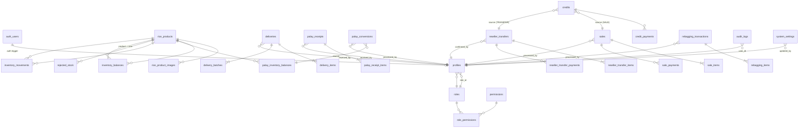
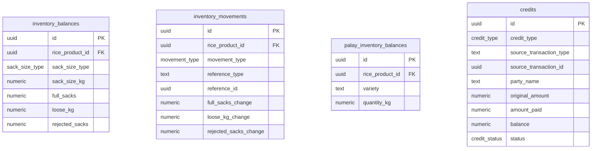

# RIMS Database Architecture — Implemented Reference

This document describes the database **as built** for Brick Eight Trading Inc.
The design specification lives in `database_architecture.md` (root).

## Principles

1. **The database is the single source of truth.** Business transactions enter
   through `SECURITY DEFINER` RPC functions; inventory, credits and audit rows
   are written in the same transaction.
2. **Clients only READ.** Row Level Security grants SELECT according to the
   caller's role permissions. Every write path (apart from product master,
   images, own profile and settings — see below) is a function call, so the UI
   can never bypass business rules.
3. **Friendly, prefixed errors.** Every raised message starts with a stable
   prefix the app maps to UI feedback:
   `NOT_AUTHENTICATED:`, `FORBIDDEN:`, `VALIDATION:`, `INSUFFICIENT_INVENTORY:`.
4. **No negative stock, no overpayment.** Balances are locked with
   `SELECT … FOR UPDATE` inside each RPC before any mutation.

## Migration history

| # | File | Contents |
| --- | --- | --- |
| 001 | `extensions_and_enums.sql` | `pgcrypto`, enums, `set_updated_at()` |
| 002 | `roles_permissions.sql` | 5 roles, 29 permissions, role mapping |
| 003 | `profiles.sql` | `profiles`, `handle_new_user` trigger (first user → SUPER_ADMIN), auth helpers |
| 004 | `rice_products.sql` | product master, images, `rice-images` bucket + storage policies |
| 005 | `inventory.sql` | `inventory_balances`, `inventory_movements`, `rejected_stock` |
| 006 | `deliveries.sql` | deliveries + items + batches |
| 007 | `palay.sql` | palay receipts + items + palay balances + conversions |
| 008 | `rebagging.sql` | rebagging transactions + items |
| 009 | `sales.sql` | sales + items + payments |
| 010 | `reseller_transfers.sql` | transfers + items + payments |
| 011 | `credits.sql` | credits + payments |
| 012 | `audit_settings.sql` | `audit_logs`, `system_settings` |
| 013 | `transaction_numbers.sql` | `transaction_counters`, `next_transaction_number()` |
| 014 | `rls.sql` | RLS on all 29 tables, read policies, direct-write policies, profile guard trigger |
| 015 | `rpc_delivery_palay_reject.sql` | helpers + `receive_delivery`, `receive_palay`, `record_reject` |
| 016 | `rpc_sales_transfers.sql` | `process_sale`, `process_reseller_transfer` |
| 017 | `rpc_rebagging_conversion_credits.sql` | `process_rice_rebagging`, `process_palay_to_rice`, `record_credit_payment` |
| 018 | `views.sql` | 11 reporting/dashboard views (`security_invoker`) |
| 019 | `seed.sql` | 3 rice products + system setting defaults |
| 020 | `rpc_adjust_inventory.sql` | `adjust_inventory` (physical stock count) |
| 021 | `rpc_product_catalog.sql` | `get_product_catalog` (POS picker for roles without `inventory.view`) |

Apply with `supabase db push`. Run the test suite with `npm run test:db`.

## ERD





## Enums

| Enum | Values |
| --- | --- |
| `sack_size_type` | `25KG`, `50KG`, `OTHER` (actual weight in `sack_size_kg`) |
| `movement_type` | `DELIVERY_RECEIVED`, `SALE`, `TRANSFER_TO_RESELLER`, `REBAGGING_OUT`, `REBAGGING_IN`, `PALAY_CONVERSION_IN`, `REJECT`, `STOCK_ADJUSTMENT` |
| `payment_status` | `PAID`, `PARTIALLY_PAID`, `UNPAID` |
| `payment_method` | `CASH`, `GCASH`, `BANK_TRANSFER`, `CARD`, `CREDIT` |
| `selling_method` | `PER_SACK`, `PER_KG` |
| `credit_type` | `SALE`, `RESELLER_TRANSFER` |
| `credit_status` | `OPEN`, `PARTIALLY_PAID`, `PAID` |
| `rebagging_type` | `RICE_TO_RICE` |
| `transaction_status` | `COMPLETED`, `VOIDED` |

## Roles and permissions

Five roles: `SUPER_ADMIN`, `OWNER`, `MANAGER`, `SECRETARY`, `OTHER_STAFF`
(29 permission codes, mapped in migration 002).

- **SUPER_ADMIN** — everything, including users and settings.
- **OWNER** — all business modules + `users.view`.
- **MANAGER** — all business modules (no user/settings admin).
- **SECRETARY** — dashboard, sales, delivery, palay, rebagging, transfer,
  credits (no inventory admin, reports, users, settings).
- **OTHER_STAFF** — no default permissions; granted individually.

Guard trigger `guard_profile_changes()`: nobody deactivates their own account;
only SUPER_ADMIN grants the SUPER_ADMIN role.

## RLS model

Enabled on all 29 tables (not forced — table owner bypasses it so the
`SECURITY DEFINER` RPCs are unaffected).

**Read:** each module's tables are visible with the matching `*.view`
permission (`sales.view` → sales tables, `inventory.view` → inventory tables,
…). Exceptions: `roles`/`permissions`/`role_permissions` and
`system_settings` readable by all authenticated users; `profiles` readable for
your own row, or any row with `users.view`; `transaction_counters` has no read
policy (only `next_transaction_number()` uses it); `audit_logs` requires
`users.view`.

**Direct writes (everything else is RPC-only):**

| Table | Policy |
| --- | --- |
| `rice_products`, `rice_product_images` | `inventory.adjust` |
| `profiles` (update) | `users.update` + guard trigger |
| `system_settings` (insert/update) | `settings.update` |

`authenticated` has table-level grants from Supabase defaults, so a missing
policy means: **INSERT/UPDATE/DELETE → RLS error, SELECT → 0 rows.**

## RPC catalog

All RPCs are `SECURITY DEFINER`, take one `jsonb` payload, return a `jsonb`
summary, and raise prefixed errors.

| Function | Permission | Effect |
| --- | --- | --- |
| `receive_delivery(payload)` | `delivery.create` | Delivery + batches + stock **+**, movement `DELIVERY_RECEIVED` |
| `receive_palay(payload)` | `palay.create` | Palay receipt, palay KG **+** (never touches rice) |
| `process_sale(payload)` | `sales.create` | Sale, stock **−** (PER_KG opens sacks), payment, optional credit, audit |
| `process_reseller_transfer(payload)` | `transfer.create` | Transfer, stock **−**, payment, optional credit |
| `record_reject(payload)` | `inventory.reject` | Available → rejected sacks |
| `adjust_inventory(payload)` | `inventory.adjust` | Physical count correction, movement `STOCK_ADJUSTMENT` (reason required) |
| `process_rice_rebagging(payload)` | `rebagging.create` | Rice → rice computed **in KG**, never copies sack counts |
| `process_palay_to_rice(payload)` | `rebagging.create` | Palay KG **−**, rice sacks **+**, yield/loss recorded |
| `record_credit_payment(payload)` | `credits.payment` | Payment on a locked credit, blocks overpayment, syncs source sale/transfer |
| `get_product_catalog()` | any transaction-create perm or `inventory.view` | Active products + stock for the POS picker (Secretary has no `inventory.view`) |

### Key rules encoded in the functions

- **PER_KG sales** consume loose KG first, then open
  `ceil((needed − loose) / sack_size_kg)` whole sacks; leftover becomes loose.
- **Rebagging** converts source KG → destination KG with loss
  (`dest_kg = src_sacks × src_size − loss`), destination sacks =
  `floor(dest_kg / dest_size)`, remainder to loose KG. Source and destination
  must differ.
- **Palay conversion** requires `output ≤ input`; `loss = input − output`,
  `yield = output / input × 100`.
- **Credits** are created from unpaid sales/transfers with
  `original_amount = total`, `amount_paid = paid down payment`
  (`balance = original − paid` invariant enforced by CHECK). Payments are
  locked `FOR UPDATE`; paying above the balance is rejected.
- **Transaction numbers**: `PREFIX-YYYYMMDD-NNNN` (Asia/Manila day),
  prefixes `DEL, PAL, SAL, REB, CON, TRF`, counters row-locked per prefix.

## Views (all `security_invoker = true`)

`v_current_rice_inventory`, `v_palay_inventory`, `v_inventory_movements`,
`v_sales_summary`, `v_delivery_summary`, `v_reseller_transfer_summary`,
`v_credit_balances`, `v_rebagging_history`, `v_palay_conversions`,
`v_recent_transactions`, `v_product_catalog`.

Daily summaries bucket by `(timestamp at time zone 'Asia/Manila')::date`.

## Storage

Bucket `rice-images` (public bucket — images are publicly readable; INSERT /
UPDATE / DELETE on `storage.objects` require `inventory.adjust`), one path per
product, single primary image enforced by a partial unique index. Max 5 MB,
jpeg/png/webp only.

## Seed data (migration 019)

- Products: Princess Bea, Hasmin Blue, Dinorado (active).
- Settings: `company` (name/currency/PHP/date format/timezone), `pos`,
  `inventory` (sack sizes 25/50/OTHER), `credits`.

No business/transaction data is seeded. The first user who signs up becomes
SUPER_ADMIN automatically (`handle_new_user`).

## Testing

```text
npm run test:db            # every tests/*.sql
npm run test:db 03         # files matching "03"
```

Each file runs as `begin; … rollback;` with throwaway users impersonated via
JWT claims, so the remote database is never mutated. See `docs/test-cases.md`.
